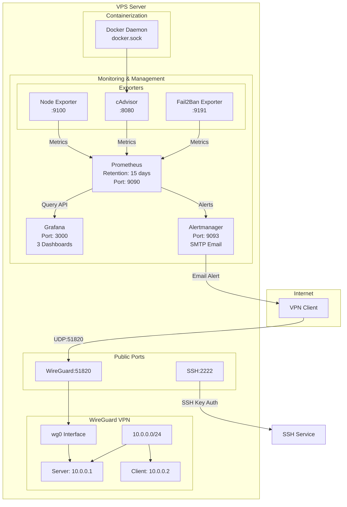
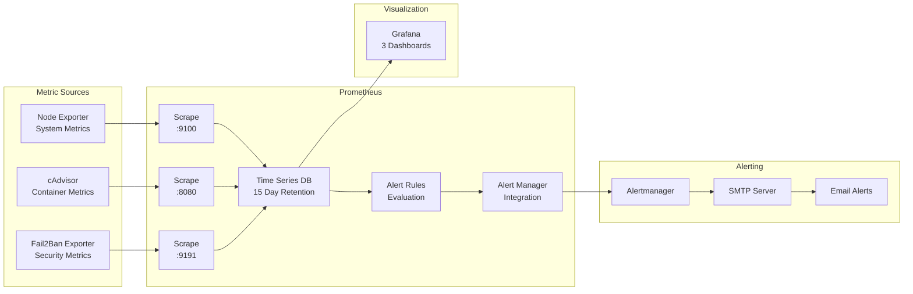
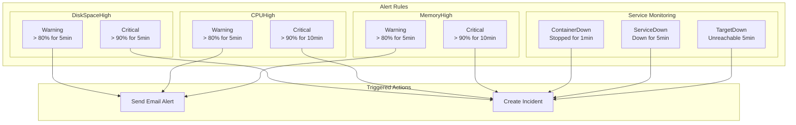
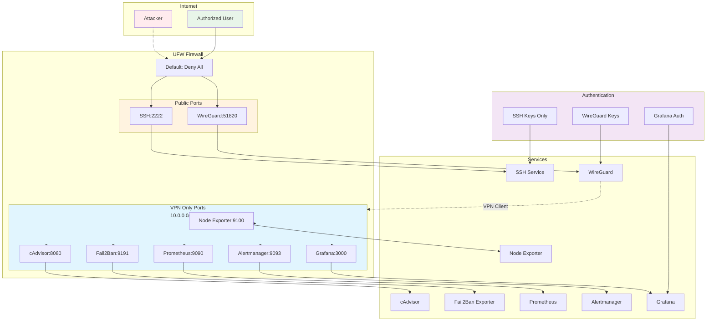
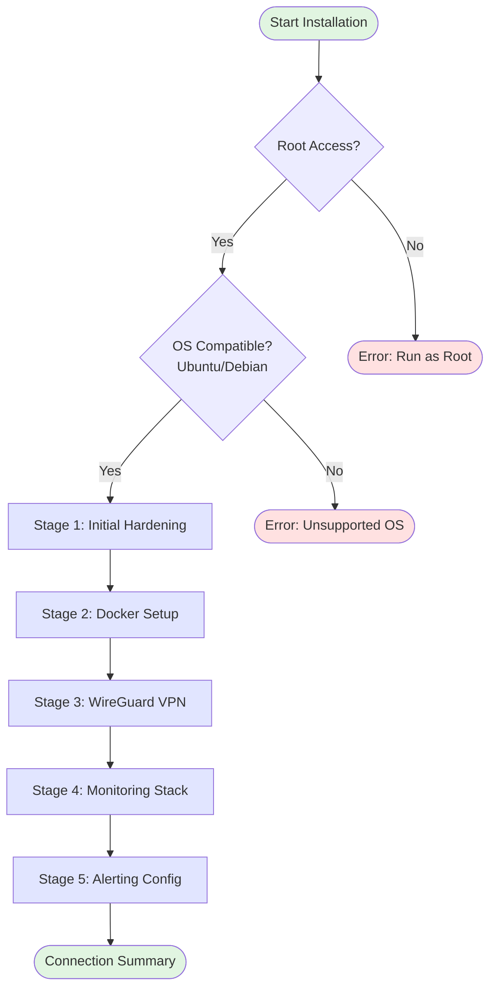
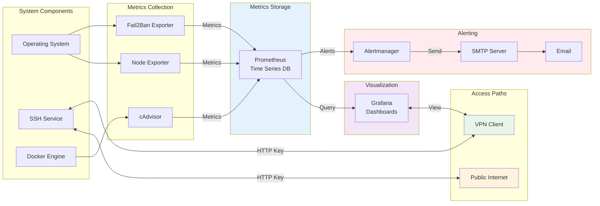
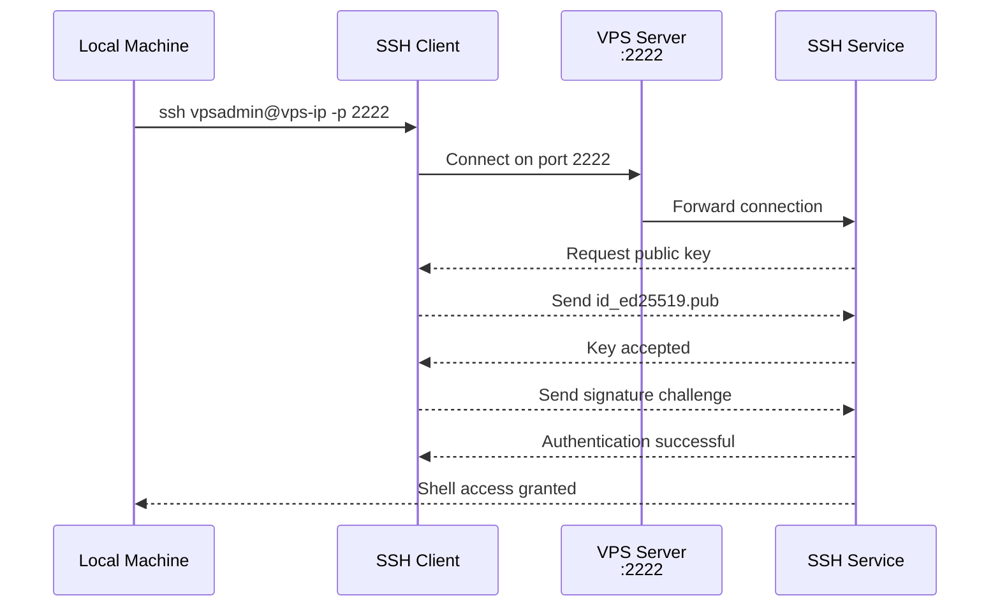
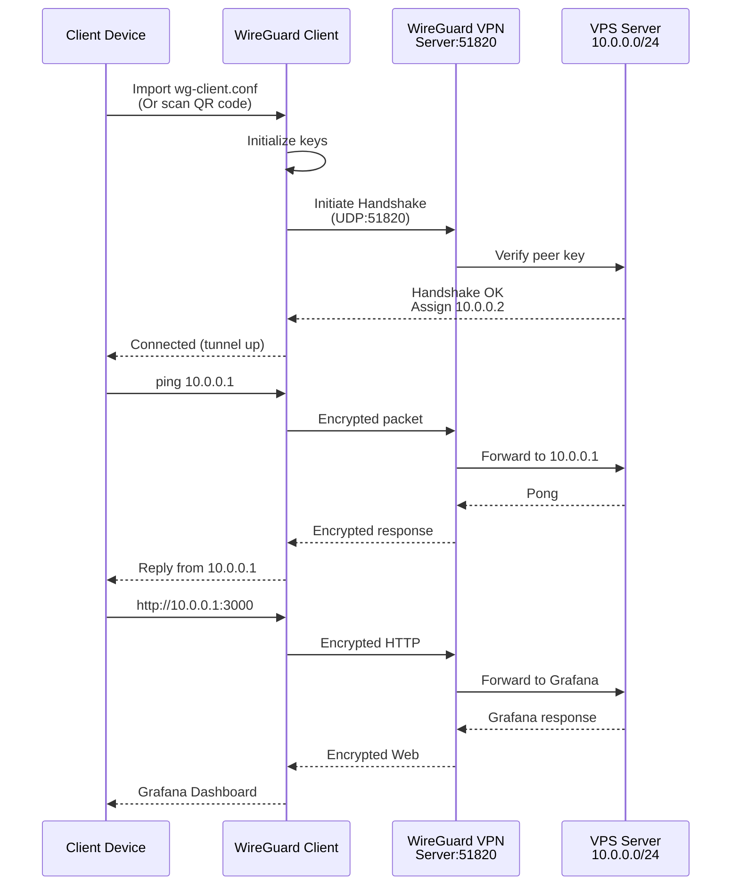
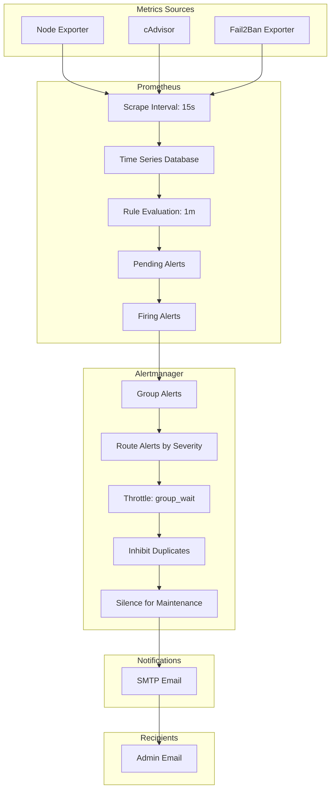
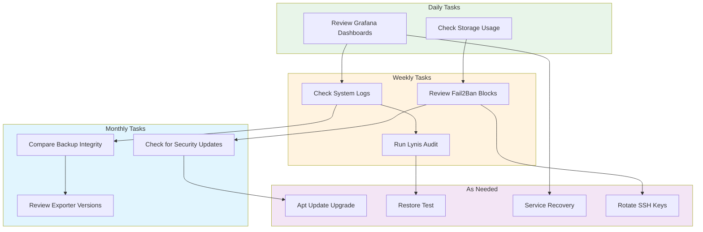

# VPS Setup System - Design Document

## Overview
This project provides automated scripts to set up and configure a secure, production-ready VPS with essential security tools, containerization, VPN access, comprehensive monitoring, and alerting.

## Target Environment
- **OS**: Ubuntu 20.04+ / Debian 11+
- **Shell**: Bash 4.0+
- **Init System**: systemd
- **Architecture**: Single machine deployment

## System Architecture



## Project Structure

```
vps_setup/
├── 01_initial_hardening.sh          # Base security hardening
├── 02_docker_setup.sh               # Docker and Compose installation
├── 03_wireguard_setup.sh            # WireGuard VPN configuration
├── 04_monitoring_setup.sh           # Monitoring stack setup
├── 05_alerting_setup.sh             # Alertmanager configuration
├── lib/
│   ├── common.sh                    # Shared utility functions
│   └── logger.sh                    # Logging functionality
├── configs/
│   ├── prometheus.yml               # Prometheus configuration
│   ├── prometheus_alert_rules.yml   # Alert rule definitions
│   ├── alertmanager.yml             # Alertmanager configuration
│   ├── wg0.conf.template            # WireGuard interface template
│   └── grafana_dashboards/
│       ├── system_overview.json     # System metrics dashboard
│       ├── docker_containers.json   # Docker metrics dashboard
│       └── security_status.json    # Security metrics dashboard
├── install_all.sh                   # Master installation script
├── README.md                        # User documentation
├── Design.md                        # This file
└── .env.example                     # Configuration template
```

## Module Dependencies

```mermaid
flowchart TB
    START[Fresh VPS]
    H1[01_initial_hardening.sh]
    H2[02_docker_setup.sh]
    H3[03_wireguard_setup.sh]
    H4[04_monitoring_setup.sh]
    H5[05_alerting_setup.sh]

    subgraph Foundations["Foundation Layer"]
        SSH[SSH :2222]
        UFW[UFW Firewall]
        USER[Non-root User]
    end

    subgraph Platform["Platform Layer"]
        DOCKER[Docker Engine]
        WG[WireGuard VPN<br/>10.0.0.0/24]
    end

    subgraph Monitoring["Monitoring Layer"]
        PROM[Prometheus]
        GF[Grafana]
        ALM[Alertmanager]
    end

    subgraph Outputs["Final Outputs"]
        SECURE[Secure VPS]
        VPN_ACCESS[Management via VPN]
        METRICS[Full Monitoring Stack]
        ALERTS[Email Alerting]
    end

    START --> H1
    H1 --> |Depends on| H1
    H2 --> |Depends on| H1
    H3 --> |Depends on| H1
    H4 --> |Depends on| H1, H2, H3
    H5 --> |Depends on| H4

    H1 --> SSH
    H1 --> UFW
    H1 --> USER
    SSH --> SECURE
    UFW --> SECURE
    USER --> SECURE

    H2 --> DOCKER
    H3 --> WG
    DOCKER --> VPN_ACCESS
    WG --> VPN_ACCESS

    H4 --> PROM
    H4 --> GF
    H4 --> ALM
    PROM --> METRICS
    GF --> METRICS
    ALM --> METRICS

    H5 --> ALM
    ALM --> ALERTS

    style START fill:#e8f5e9
    style SECURE fill:#c8e6c9
    style VPN_ACCESS fill:#ffe0b2
    style METRICS fill:#bbdefb
    style ALERTS fill:#f8bbd0
    style Foundations fill:#fff9c4
    style Platform fill:#e1bee7
    style Monitoring fill:#b2dfdb
```

## Module Specifications

### 1. Initial Hardening (01_initial_hardening.sh)

**Purpose**: Establish baseline security configuration

**Prerequisites**: Root access, fresh OS installation

**Actions**:
- Verify OS compatibility (Ubuntu 20.04+ / Debian 11+)
- Update and upgrade all system packages
- Install core packages: ufw, fail2ban, sudo, curl, wget, git, htop, ncdu
- Configure SSH:
  - Change port from 22 to configurable value (default: 2222)
  - Disable root login: `PermitRootLogin no`
  - Disable password authentication: `PasswordAuthentication no`
  - Restart sshd service
- Configure UFW firewall:
  - Default deny incoming
  - Default allow outgoing
  - Allow configured SSH port
  - Enable firewall
- Create non-root user:
  - Generate secure password
  - Add to sudo group
  - Configure sudoers for passwordless sudo (optional)
- Install security tools:
  - rkhunter (rootkit detection)
  - chkrootkit (rootkit detection)
  - lynis (security auditing)
- Disable unused services:
  - telnet.socket
  - rsh.socket
- Configure unattended-upgrades for automatic security patches
- Clean up unnecessary packages

**Outputs**:
- Non-root user with sudo privileges
- SSH accessible only on non-standard port with key authentication
- Active firewall with minimal open ports
- Automatic security updates enabled
- Security scanning tools installed

---

### 2. Docker Setup (02_docker_setup.sh)

**Purpose**: Install and configure container runtime

**Prerequisites**: Completed initial hardening

**Actions**:
- Install Docker prerequisites:
  - ca-certificates
  - gnupg
  - lsb-release
- Add Docker GPG key to system
- Add Docker repository to APT sources
- Install Docker CE and docker-compose-plugin
- Create docker group
- Add non-root user to docker group
- Configure Docker daemon (/etc/docker/daemon.json):
  - Enable live-restore: prevents containers from stopping on daemon restart
  - Configure log rotation:
    - max-size: 10m
    - max-file: 3
  - Set DNS servers: 1.1.1.1, 8.8.8.8
- Start Docker service
- Enable Docker service on boot

**Outputs**:
- Docker CE installed
- Docker Compose v2 plugin available
- Non-root user can run Docker commands
- Docker daemon hardened with log rotation
- Docker service running and enabled

---

### 3. WireGuard Setup (03_wireguard_setup.sh)

**Purpose**: Establish secure VPN access for management

**Prerequisites**: Completed initial hardening

**Network Configuration**:
- VPN Subnet: 10.0.0.0/24
- Server IP: 10.0.0.1
- Client IP: 10.0.0.2/32
- Listen Port: 51820/udp

**Actions**:
- Install WireGuard packages
- Generate cryptographic keys:
  - Server private key
  - Server public key
  - Client private key
  - Client public key
- Create WireGuard configuration file (/etc/wireguard/wg0.conf):
  - Interface section: Server keys, IP address, listen port
  - Peer section: Client public key, allowed IPs
- Start WireGuard interface: `wg-quick up wg0`
- Enable WireGuard on boot
- Enable IP forwarding (/etc/sysctl.conf):
  - `net.ipv4.ip_forward=1`
  - `net.ipv4.conf.all.forwarding=1`
- Apply sysctl changes
- Configure NAT for VPN internet access:
  - Add iptables rule for masquerading
  - Persist iptables rules
- Generate client configuration file
- Generate QR code for mobile device setup
- Open WireGuard port in UFW (51820/udp)

**Outputs**:
- WireGuard interface running (wg0)
- User can connect via VPN to 10.0.0.0/24 subnet
- VPN users can access internet through VPS
- Client configuration file generated (wg-client.conf)
- QR code generated for mobile import
- WireGuard automatically starts on boot

---

### 4. Monitoring Setup (04_monitoring_setup.sh)

**Purpose**: Deploy comprehensive monitoring stack

**Prerequisites**: Completed Docker setup and WireGuard setup

**Components Installed**:

#### Node Exporter
- **Port**: 9100/tcp (VPN only)
- **Purpose**: Collect system-level metrics (CPU, memory, disk, network)
- **Installation**:
  - Download latest release from GitHub
  - Create node_exporter system user
  - Create systemd service file
  - Enable and start service

#### cAdvisor
- **Port**: 8080/tcp (VPN only)
- **Purpose**: Collect container metrics
- **Installation**: Run as Docker container
  - Mount: /var/run/docker.sock
  - Mount: /sys, /var/lib/docker
  - Restart policy: always

#### Fail2Ban Exporter
- **Port**: 9191/tcp (VPN only)
- **Purpose**: Expose Fail2Ban statistics
- **Installation**:
  - Download exporter binary
  - Create systemd service
  - Grant access to Fail2Ban socket

#### Prometheus
- **Port**: 9090/tcp (VPN only)
- **Purpose**: Central metrics collection engine
- **Retention**: 15 days (configurable)
- **Installation**:
  - Download latest release
  - Create prometheus system user
  - Configure prometheus.yml with scrape targets:
    - job_name: 'node_exporter'
    - job_name: 'cadvisor'
    - job_name: 'fail2ban_exporter'
  - Create systemd service
  - Enable and start service



#### Grafana
- **Port**: 3000/tcp (VPN only)
- **Purpose**: Data visualization dashboards
- **Installation**:
  - Add Grafana GPG key and repository
  - Install grafana package
  - Configure /etc/grafana/grafana.ini:
    - admin password (from .env)
    - anonymous access: disabled
  - Start Grafana service
  - Add Prometheus as data source (localhost:9090)
  - Import pre-configured dashboards:
    - System Overview (node exporter)
    - Docker Containers (cAdvisor)
    - Security Status (Fail2Ban)

**Firewall Rules** (VPN subnet only):
```
allow from 10.0.0.0/24 to any port 9100 proto tcp  # Node Exporter
allow from 10.0.0.0/24 to any port 8080 proto tcp  # cAdvisor
allow from 10.0.0.0/24 to any port 9191 proto tcp  # Fail2Ban Exporter
allow from 10.0.0.0/24 to any port 9090 proto tcp  # Prometheus
allow from 10.0.0.0/24 to any port 9093 proto tcp  # Alertmanager
allow from 10.0.0.0/24 to any port 3000 proto tcp  # Grafana
```

**Outputs**:
- System metrics being collected (Node Exporter)
- Container metrics being collected (cAdvisor)
- Security metrics being collected (Fail2Ban Exporter)
- Central metrics database (Prometheus)
- 3 Pre-configured dashboards (Grafana)
- All monitoring components accessible only via VPN

---

### 5. Alerting Setup (05_alerting_setup.sh)

**Purpose**: Configure email-based alerting for system events

**Prerequisites**: Completed monitoring setup

**Components Installed**:

#### Alertmanager
- **Port**: 9093/tcp (VPN only)
- **Purpose**: Route and manage alerts from Prometheus
- **Installation**:
  - Download latest release
  - Create alertmanager system user
  - Configure alertmanager.yml:
    - SMTP server, port, username, password (from .env)
    - From address and to address
    - Email template settings
  - Create systemd service
  - Enable and start service

#### Prometheus Alert Rules
Configure alert rules in prometheus_alert_rules.yml:



**DiskSpaceHigh**
- Warning: disk usage > 80% for 5 minutes
- Critical: disk usage > 90% for 5 minutes
- Annotations: mount point, current usage, available space

**CPUHigh**
- Warning: CPU > 80% for 5 minutes
- Critical: CPU > 90% for 10 minutes
- Annotations: current CPU percentage

**MemoryHigh**
- Warning: memory > 80% for 5 minutes
- Critical: memory > 90% for 10 minutes
- Annotations: current memory percentage

**ContainerDown**
- Alert: Container has stopped
- Duration: 1 minute
- Annotations: container name

**ServiceDown**
- Alert: Monitoring service is down
- Duration: 5 minutes
- Annotations: service name

**PrometheusTargetDown**
- Alert: Exporter target is unreachable
- Duration: 5 minutes
- Annotations: target name, instance

**Firewall Configuration**:
- Open port 9093/tcp for VPN subnet (10.0.0.0/24)

**Outputs**:
- Alertmanager running and accessible via VPN
- Prometheus configured to send alerts to Alertmanager
- Email alerts configured for system and service issues
- Alert rules defined for common scenarios

---

## Library Functions

### lib/common.sh

**Utility Functions**:
- `log_info "message"`: Print info message in blue
- `log_success "message"`: Print success message in green
- `log_warning "message"`: Print warning message in yellow
- `log_error "message"`: Print error message in red
- `check_root()`: Exit with error if not running as root
- `check_os()`: Verify Ubuntu/Debian, exit on failure
- `install_if_missing "package"`: Install package if not present
- `backup_file "filepath"`: Create .bak backup of file
- `enable_service "service_name"`: Start and enable systemd service
- `get_latest_release "owner/repo"`: Fetch latest release from GitHub API

### lib/logger.sh

**Logging Functions**:
- Setup /var/log/vps_setup.log
- Configure logrotate for setup logs
- `log_to_file "level" "message"`: Write to log with timestamp

---

## Configuration (.env)

```bash
# SSH Settings
SSH_PORT=2222

# User
NEW_USERNAME=vpsadmin

# Timezone
TIMEZONE=UTC

# Docker
DOCKER_USER=vpsadmin

# WireGuard
WG_INTERFACE=wg0
WG_PORT=51820
WG_SERVER_IP=10.0.0.1
WG_CLIENT_NAME=laptop

# Prometheus Monitoring
PROMETHEUS_RETENTION=15d

# Grafana
GRAFANA_PORT=3000
GRAFANA_ADMIN_PASSWORD=changeme123

# Email Alerts (for Alertmanager)
SMTP_SERVER=smtp.gmail.com
SMTP_PORT=587
SMTP_USERNAME=your-email@gmail.com
SMTP_PASSWORD=app-password
ALERT_FROM=vps-alerts@yourdomain.com
ALERT_TO=your-email@gmail.com
```

---

## Network Security Architecture



## Security Considerations

### Network Security
- SSH port changed from 22 to non-standard port
- SSH root login disabled
- SSH password authentication disabled (key-only)
- All monitoring ports accessible only via VPN
- Public ports: SSH (2222), WireGuard (51820)
- Firewall default deny all incoming

### Application Security
- Non-root user for daily operations
- Sudo access for privileged commands
- Automatic security updates enabled
- Fail2Ban blocking brute-force attacks
- Security scanning tools installed
- Grafana admin authentication required
- No anonymous access to monitoring tools

### Data Security
- Monitoring data retention: 15 days (configurable)
- Docker container isolation
- VPN encryption for management access
- Log rotation configured for all services

---

## Firewall Rules Summary

### Public Access
```bash
# SSH direct access (initial/setup)
ufw allow 2222/tcp

# WireGuard VPN
ufw allow 51820/udp

# Default policies
ufw default deny incoming
ufw default allow outgoing
```

### VPN-Only Access (10.0.0.0/24)
```bash
# Monitoring stack
ufw allow from 10.0.0.0/24 to any port 9100 proto tcp  # Node Exporter
ufw allow from 10.0.0.0/24 to any port 8080 proto tcp  # cAdvisor
ufw allow from 10.0.0.0/24 to any port 9191 proto tcp  # Fail2Ban Exporter
ufw allow from 10.0.0.0/24 to any port 9090 proto tcp  # Prometheus
ufw allow from 10.0.0.0/24 to any port 9093 proto tcp  # Alertmanager
ufw allow from 10.0.0.0/24 to any port 3000 proto tcp  # Grafana
```

---

## Installation Sequence



## Data Flow



### Installation Sequence (install_all.sh)

```bash
#!/bin/bash
# Master installation script

source ./lib/common.sh
source ./lib/logger.sh

check_root
check_os

log_info "Starting VPS Setup..."

# Stage 1: Initial Hardening
log_info "[1/5] Running initial hardening..."
./01_initial_hardening.sh || exit 1

# Stage 2: Docker Setup
log_info "[2/5] Setting up Docker..."
./02_docker_setup.sh || exit 1

# Stage 3: WireGuard Setup
log_info "[3/5] Configuring WireGuard VPN..."
./03_wireguard_setup.sh || exit 1

# Stage 4: Monitoring Setup
log_info "[4/5] Deploying monitoring stack..."
./04_monitoring_setup.sh || exit 1

# Stage 5: Alerting Setup
log_info "[5/5] Configuring alerting..."
./05_alerting_setup.sh || exit 1

log_success "VPS Setup Complete!"

# Print connection summary
echo ""
echo "============================================"
echo "         Connection Summary"
echo "============================================"
echo ""
echo "SSH:         ssh $NEW_USERNAME@<your-ip> -p $SSH_PORT"
echo ""
echo "WireGuard:"
echo "  Server IP: $WG_SERVER_IP"
echo "  Client IP: 10.0.0.2"
echo "  Config:    ./configs/wg-client.conf"
echo ""
echo "Monitoring (VPN-only):"
echo "  Grafana:      http://$WG_SERVER_IP:$GRAFANA_PORT"
echo "  Prometheus:   http://$WG_SERVER_IP:9090"
echo "  Alertmanager: http://$WG_SERVER_IP:9093"
echo ""
echo "============================================"
```

---

## Post-Installation Steps

### 1. SSH Key Setup
- On local machine: Generate SSH key pair
- `ssh-keygen -t ed25519 -C "your-email@example.com"`
- Copy public key to VPS: `ssh-copy-id -i ~/.ssh/id_ed25519.pub -p 2222 vpsadmin@your-vps-ip`
- Test SSH: `ssh vpsadmin@your-vps-ip -p 2222`



### 2. WireGuard Client Setup



### 2. WireGuard Client Setup
- Copy `wg-client.conf` to your device
- For mobile: Scan QR code and import into WireGuard app
- For desktop: Import config file into WireGuard client
- Activate VPN connection, test: `ping 10.0.0.1`

### 3. Access Grafana
- Connect via WireGuard VPN
- Open browser: `http://10.0.0.1:3000`
- Login: `admin` (password from .env)
- View pre-configured dashboards

### 4. Verify All Services
```bash
# Check service status
systemctl status sshd
systemctl status ufw
systemctl status docker
systemctl status wg-quick@wg0
systemctl status node_exporter
systemctl status prometheus
systemctl status grafana-server
systemctl status alertmanager

# Check WireGuard
wg show

# Check Docker
docker ps

# Check Prometheus targets
curl http://localhost:9090/api/v1/targets
```

### 5. Test Alerts
- Temporarily stop Node Exporter: `systemctl stop node_exporter`
- Wait 5 minutes for alert to trigger
- Check email for alert notification
- Restart service: `systemctl start node_exporter`

---

## Troubleshooting

### WireGuard Connection Issues
- Check: `wg show` - verify interface is up
- Check: `ip route` - verify 10.0.0.0/24 routing
- Check: `ufw status` - verify port 51820 is open
- Check firewall logs: `/var/log/ufw.log`

### Monitoring Not Working
- Check exporter service status
- Verify firewall rules allow VPN subnet
- Check Prometheus targets: `/api/v1/targets`
- Check Prometheus logs: `/var/log/prometheus/prometheus.log`

### Docker Issues
- Check: `systemctl status docker` - verify service running
- Check: `docker info` - verify daemon responding
- Check Docker logs: `journalctl -u docker`

### Email Alerts Not Sending
- Verify SMTP credentials in .env
- Check Alertmanager logs: `/var/log/alertmanager/alertmanager.log`
- Test SMTP configuration manually
- Check if Alertmanager is receiving alerts from Prometheus

---

## Maintenance

### Regular Tasks
- Review Grafana dashboards weekly
- Check system logs for anomalies: `/var/log/auth.log`, `/var/log/syslog`
- Run security audits: `lynis audit system`
- Update system regularly: `apt update && apt upgrade`
- Monitor storage usage: `df -h`
- Review blocked IPs in Fail2Ban: `fail2ban-client status sshd`

### Backup Strategy
- Backup configuration files:
  - `/etc/wireguard/wg0.conf`
  - `/etc/ssh/sshd_config`
  - `/etc/ufw/user.rules`
  - Grafana dashboards (export from UI)
- Database backups: Configure regular backups for application data
- Consider setting up rsync backup to remote location

### Updates
- Docker: `apt update && apt upgrade docker-ce`
- Exporters: Monitor for new releases, update binaries
- Grafana: `apt update && apt upgrade grafana`
- Prometheus: Monitor for new releases, update binary

---

## Glossary

| Term | Definition |
|------|------------|
| **VPS** | Virtual Private Server - a virtual machine hosted in the cloud |
| **SSH** | Secure Shell - protocol for secure remote access |
| **UFW** | Uncomplicated Firewall - firewall management tool for Ubuntu/Debian |
| **Fail2Ban** | Intrusion prevention software that blocks IP addresses with too many failed authentication attempts |
| **WireGuard** | Modern VPN protocol - faster and simpler than OpenVPN |
| **Docker** | Platform for developing, shipping, and running applications in containers |
| **Prometheus** | Open-source monitoring and alerting toolkit |
| **Grafana** | Open-source analytics and interactive visualization web application |
| **Alertmanager** | Handles alerts sent by Prometheus |
| **Exporter** | Program that exposes metrics in Prometheus format |
| **Node Exporter** | Prometheus exporter for hardware and OS metrics |
| **cAdvisor** | Container Advisor - analyzes and exposes container resource usage |
| **Scrape** | Act of collecting metrics from an endpoint |
| **Retention** | How long data is stored before being deleted |
| **Dashboard** | Visual representation of metrics in Grafana |
| **Panel** | Single visualization within a dashboard |
| **Time series** | Sequence of data points indexed by time |

---

## References

- [SSH Hardening Guide](https://www.ssh.com/academy/ssh/hardening)
- [UFW Documentation](https://help.ubuntu.com/community/UFW)
- [Fail2Ban Manual](https://fail2ban.readthedocs.io/)
- [WireGuard Quickstart](https://www.wireguard.com/quickstart/)
- [Docker Security Best Practices](https://docs.docker.com/engine/security/)
- [Prometheus Documentation](https://prometheus.io/docs/)
- [Grafana Documentation](https://grafana.com/docs/)
- [Alertmanager Configuration](https://prometheus.io/docs/alerting/latest/configuration/)
- [Node Exporter](https://github.com/prometheus/node_exporter)
- [cAdvisor](https://github.com/google/cadvisor)

---

## Alert Flow Diagram



## Maintenance Workflow



## Version History

| Version | Date | Changes |
|---------|------|---------|
| 1.0 | 2026-02-11 | Initial design document |
| 1.1 | 2026-02-11 | Added mermaid diagrams for architecture, alert flow, and workflows |

---

## License

This project is provided as-is for educational and production use. Modify as needed for your specific environment.